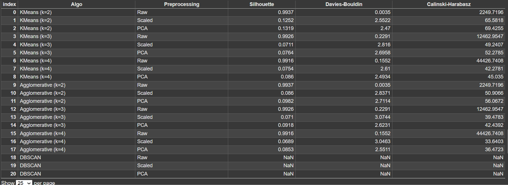

# 🧪 Clustering Evaluation Report - Drug-Induced Autoimmunity Dataset

This project explores the **comparative performance** of different clustering algorithms on the **Drug-Induced Autoimmunity Prediction dataset** using multiple preprocessing techniques and evaluation metrics.

---

## 📂 Dataset Info

- **Source:** UCI Machine Learning Repository
- **Shape:** `477 samples × 196 features` (excluding labels and SMILES)
- **Preprocessing:**
  - Raw features
  - Standard Scaler
  - PCA (95% variance retained → 70 components)

---

## ⚙️ Clustering Algorithms

| Algorithm                | Variants Used              |
| ------------------------ | -------------------------- |
| KMeans                   | `k = [2, 3, 4]`            |
| Agglomerative Clustering | `k = [2, 3, 4]`            |
| DBSCAN                   | `eps=0.5`, `min_samples=5` |

---

## 📊 Evaluation Metrics

| Metric                      | Interpretation             |
| --------------------------- | -------------------------- |
| **Silhouette Score**        | Higher = better separation |
| **Davies-Bouldin Score**    | Lower = better clustering  |
| **Calinski-Harabasz Index** | Higher = denser clusters   |

---

## 📊 Results Table

---

## 🔍 KMeans Cluster Visualization

## 📝 Results Summary

📌 _Refer to the images below for full result tables and graphs._

### ✅ Best Performers

| Technique     | Preprocessing | k   | Highlights                    |
| ------------- | ------------- | --- | ----------------------------- |
| KMeans        | Raw           | 2   | Best Silhouette and DB scores |
| Agglomerative | Raw           | 2   | Matches KMeans on Silhouette  |
| KMeans/Agglo  | Raw           | 4   | Best Calinski-Harabasz Index  |

---

## 🧠 Observations

- **Raw data consistently performs best**, outperforming scaled and PCA-transformed variants.
- **DBSCAN failed to generate valid clusters** in all cases, likely needing more fine-tuning (`eps`, `min_samples`).
- **PCA did not improve clustering** but can still be useful in high-dimensional settings.

---

## ✅ Conclusion

- Use **KMeans or Agglomerative Clustering with `k=2`** on raw features for best performance.
- Raw descriptors in this dataset are highly informative without additional preprocessing.

---
